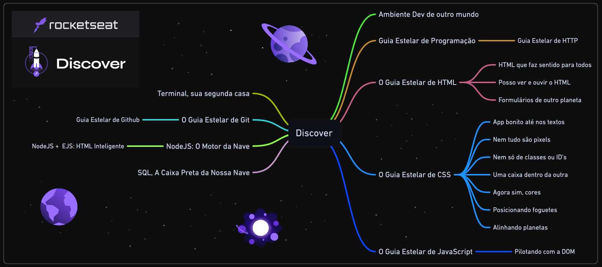
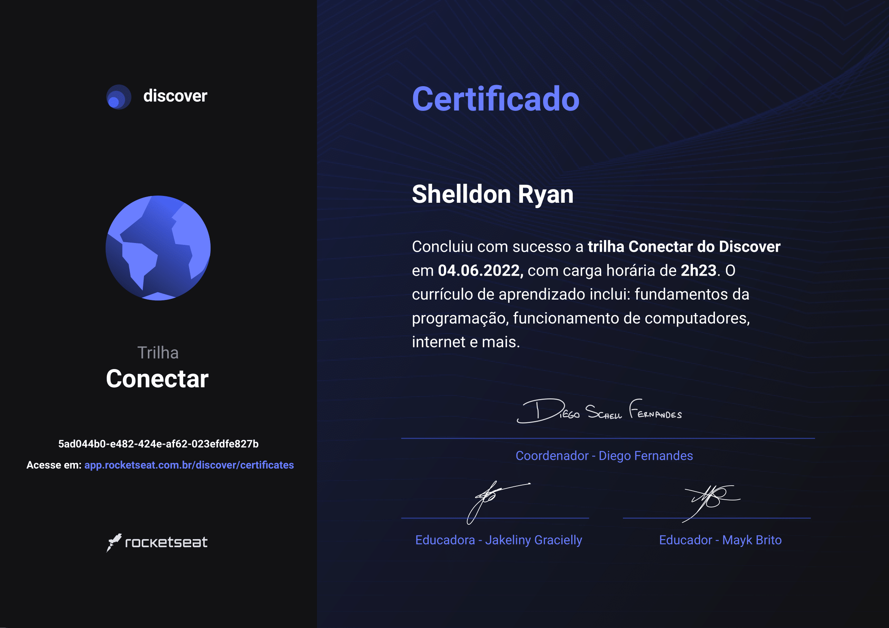

# Rocketseat - Discover

## Tecnologias Estudadas

 
  
  
  
  
  
  
  
  
  

## Certificados

  
  
Código: 5ad044b0-e482-424e-af62-023efdfe827b

   
  
  
Código: ec4f3a8d-946b-442f-8a9b-115a78715d58

   
  
  
Código: 14cb5b87-70b8-498e-820e-94496001f8d7

    

## Anotações

 
  💻 <a href="/Starter-Terminal/terminal.md"><strong>Terminal</strong></a>&nbsp;&nbsp; | &nbsp;&nbsp;
  🕓 <a href="/Starter-Git/git.md"><strong>Git</strong></a>&nbsp;&nbsp; | &nbsp;&nbsp;
  🖥️ <a href="/Starter-NodeJS/node.md"><strong>NodeJS</strong></a>&nbsp;&nbsp; | &nbsp;&nbsp;
  ⌨️ <a href="/Starter-NodeJS/node_ejs.md"><strong>EJS</strong></a>&nbsp;&nbsp; | &nbsp;&nbsp;
  🏞️ <a href="/Starter-React/react.md"><strong>React</strong></a>&nbsp;&nbsp; | &nbsp;&nbsp;
  ⚙️ <a href="/Starter-Typescript/typescript.md"><strong>TypeScript</strong></a>&nbsp;&nbsp; | &nbsp;&nbsp;
  🔑 <a href="/Starter-HTTP/http.md"><strong>HTTP</strong></a>&nbsp;&nbsp; | &nbsp;&nbsp;
  🔓 <a href="/Starter-API/api.md"><strong>API</strong></a>&nbsp;&nbsp; | &nbsp;&nbsp;
  💾 <a href="/Starter-SQL/sql.md"><strong>SQL</strong></a>

## Módulos

<!-- ❌✔️ -->

### 🚀 **Equipando sua nave**

1. ✔️ Ambiente dev de outro mundo
1. ✔️ Terminal, sua segunda casa

#

### 📚 **Guias estelares**

1. ✔️ Guia Estelar de Programação
1. ✔️ Guia Estelar de HTTP
1. ✔️ O Guia Estelar de HTML
1. ✔️ O Guia Estelar de CSS
1. ✔️ O Guia Estelar de JavaScript
1. ✔️ Guia Estelar de Git
1. ✔️ Guia Estelar de Github
1. ✔️ Github para times

#

### 👨🏽‍🚀 **Preparação de astronautas**

1. ✔️ (HTML) Formulários de outro planeta
1. ✔️ (HTML) HTML que faz sentido, para todos
1. ✔️ (HTML) Posso ver e ouvir o HTML
1. ✔️ (JS) Pilotando com a DOM
1. ✔️ (JS) Javascript Assíncrono e Promises
1. ✔️ (JS) Trabalhando com APIs
1. ✔️ (JS) Fundamentos de ReactJS
1. ✔️ (JS) Fundamentos de Typescript
1. ✔️ (CSS) App bonito, até nos textos
1. ✔️ (CSS) Nem tudo são pixels
1. ✔️ (CSS) Nem só de classes ou ID's
1. ✔️ (CSS) Uma caixa dentro da outra
1. ✔️ (CSS) Agora sim, cores
1. ✔️ (CSS) Posicionando foguetes
1. ✔️ (CSS) Alinhando os planetas
1. ✔️ (CSS) Transition e Animation

#

### 🛰️ **Viajando ao espaço**

1. ✔️ NodeJS: O Motor da Nave
1. ✔️ NodeJS + EJS: HTML Inteligente
1. ✔️ SQL, a caixa preta da nossa nave
1. ✔️ SQL Avançado

#

## Trilhas

<!-- ❌✔️ -->

### 🌎 Conectar (Carga horária: 2 horas)

1. ✔️ Guia Estelar de Programação
1. ✔️ Computador, Software e Hardware ✨
1. ✔️ Internet, Roteadores e Servidores ✨
1. ✔️ Sistemas Operacionais ✨
1. ✔️ Linguagem de Programação ✨
1. ✔️ Tipos de Aplicações WEB ✨

#

### 🪐 Fundamentar (Carga horária: 29 horas)

1. ✔️ Ambiente Dev
1. ✔️ Guia Estelar de HTML
1. ✔️ Guia Estelar de CSS
1. ✔️ Nem tudo são Pixels
1. ✔️ Uma caixa dentro da outra
1. ✔️ Agora sim, cores
1. ✔️ Posso ver e ouvir o HTML
1. ✔️ Posicionando foguetes
1. ✔️ App bonito, até nos textos
1. ✔️ Formulários de outro planeta
1. ✔️ Guia Estelar JavaScript
1. ✔️ HTML que faz sentido, para todos
1. ✔️ Nem só de classes ou IDs
1. ✔️ Alinhando os planetas
1. ✔️ Pilotando com a DOM
1. ✔️ Terminal
1. ✔️ NodeJS
1. ✔️ Node + EJS
1. ✔️ SQL
1. ✔️ Estruturas de Dados  ✨
1. ✔️ Programação Orientada a Objetos ✨
1. ✔️ Programação Funcional ✨
1. ✔️ Guia Estelar de Git
1. ✔️ Guia estelar de Github
1. ✔️ Guia Estelar de HTTP

#

### 🌌 Especializar (Carga horária: 7 horas)

1. ✔️ Javascript Assíncrono e Promises
1. ✔️ Trabalhando com APIs
1. ✔️ Fundamentos de ReactJS
1. ✔️ Fundamentos de Typescript
1. ✔️ Github para times
1. ✔️ Transition e Animation
1. ✔️ SQL Avançado

