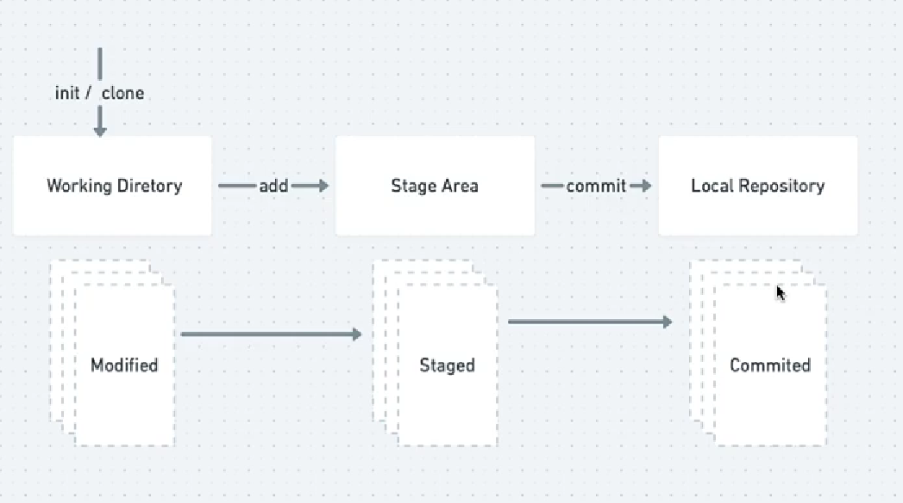
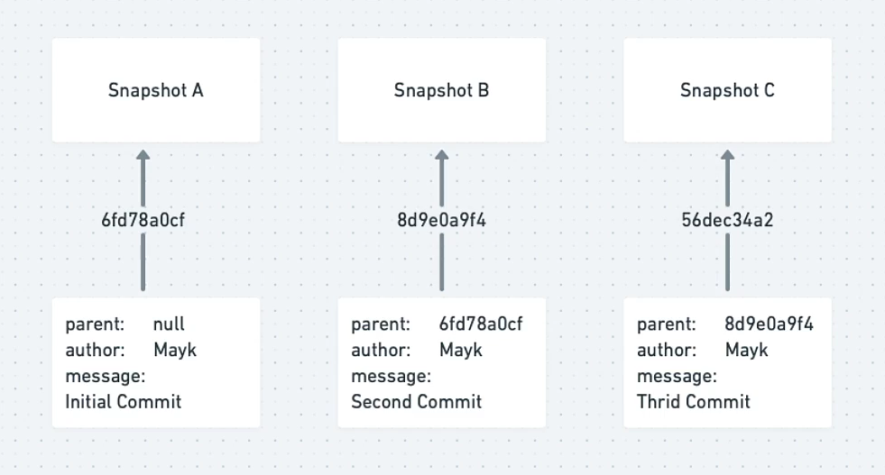

# O que é git
### Controle de versão | VCS - Version Control System

    [ ]  Registro de alterações em um ou mais arquivos
    [ ]  Mais tarde ele vai lembrar versões específicas
    [ ]  Pode reverter para estado anterior determinados arquivos ou um projeto inteiro
    [ ]  Consegue comparar as mudanças ao longo do tempo
    [ ]  Pode ver quem modificou pela ultima vez algo que pode estar causando problema
    [ ]  Quem introduziu um problema ou quando
    [ ]  Se você estragar arquivos ou perde-los, pode facilmente recuperá-lo

### Tipos de Controle de versão

Sistemas Locais

    [ ]  Propenso a erros como o de sobrescrever arquivos, caso haja feito uma cópia errada.
    [ ]  Ocorre cópia dos arquivos para outro diretório
    [ ]  muito comum e simples
    [ ]  Inclusive para superar possíveis erros exite o RCS     Revision Control System.
    [ ]  Era uma ferramenta bastante popular antigamente para controle de versão que mantém conjuntos de alterações, ou seja, a diferença entre os arquivos.
    [ ]  Formato especial em disco
    [ ]  Consegue criar re-criar qualquer arquivo do mesmo jeito que era em dado ponto do tempo, adicionando todas as alterações ao arquivo.

Sistemas Centralizados

    [ ]  Fica em um único servidor que contém todos os arquivos de controle de versão
    [ ]  Vários clientes usam arquivos a partir desse lugar central

    Vantagens sobre os locais

        [ ]  Controle sobre atividades dos colaboradores no projeto
        [ ]  Os administradores têm controle refinado sobre quem pode fazer o que
        [ ]  Mais fácil de administrar do que lidar com um banco de dados locais em cada cliente

    Desvantagens

        [ ]  Se esse servidor der problema por uma hora, durante essa hora ninguém pode colaborar ou salvar alterações de versão para o que quer que eles estejam trabalhando
        [ ]  Se o disco rígido do banco de dados central for corrompido, você perde tudo

Sistemas Distribuídos (Ex.: Git, Bazaar, Mercurial e Darcs)

    [ ]  Ducplicar(clonar) localmente o repositório completo
    [ ]  Se qualquer servidor morrer, e esses sistemas estiverem colaborando por meio dele, qualquer um dos repositórios do cliente poderá ser copiado de todos os dados
    [ ]  Cada clone é de fato um backup completo de todos os dados
    [ ]  Clientes usam o estado mais recente dos arquivos

## Afinal, o que é o git?

    [ ]  Sistema de controle de versão distribuído
    [ ]  Open-source
    [ ]  Pontos na história: commit (viagem no tempo)
        [ ]  Histórico de alterações no código
        [ ]  Voltar para qualquer ponto na histótia
    [ ]  Controlar o fluxo de novas funcionalidades
        [ ]  ramificações: branch (universos paralelos)
        [ ]  Vários devs no mesmo projeto
        [ ]  Análise e resolução de conflitos

# Configs Iniciais
    command `git config`

    [ ]  Permite ver e atribuir variáveis de configuração como nome e email
    [ ]  Estas variáveis podem ser armazenadas em 3 lugares diferentes
    1. `/etc/gitconfig` : Válido para todos os usuários no sistema e todos os seus repositórios. Se você passar a opção `--system` para `git config` , ele lê e escreve neste arquivo.
    2. `~/.gitconfig` ou `~/.config/git/config` : somente para o usuário. Você pode fazer o Git ler e escrever neste arquivo passando a opção `--global`.
    3. `config` no diretório Git(ou seja, `.git/config`) de qualuqer repositório que você esteja usando: específico para este repositório.

    command `git help`

    Traz diversas informações em relação aos comandos e atributos do git,

    
        1. Dar o "git init" em um diretório (Isso cria um .git)
        2. Dar o "git add ." para preparar os arquivos para adicionar um ponto na 
        linha do tempo. (Adicionando mudanças)
        3. Dar o "git commit -m 'mensagem qualquer'" para adicionar um ponto na história

    O `git log` ou `git log --oneline` nos mostra a nossa linha do tempo, e fala em qual delas estamos.

    `git log --since=date` or `git log --until=date` or `git log --author=shelldonryan` or `git log --greep="message"`

# Conceitos

## Estágios do arquivo

## Hash Values(SHA - 1)

    A cada commit dado ocorre o que chamamos de checksum - converte dados em números. Cada modificação feita no arquivo, ao dar o commit gerará outro hash, inclusive se não for alterado nada, se manterá o mesmo, ou seja, temos a geração de um número que é fiel a intensidade das modificações.

## Head

    Serve como um ponteiro, ele aponta para algum lugar, e vai apontar para a gente em que ponto da história nós estamos.

    Quando a head aponta master `HEAD => MASTER` , significa que estamos na linha principal.

# Alterando Arquivos
## Fazendo Mudanças

1. `git diff` (mostra as alterações feitas nos arquivos, deletou, mexeu, e mostra o que tinha dentro deles) working vs repository
2. `git diff --staged` (mostra as alterações feitas nos arquivos, deletou, mexeu, e mostra o que tinha dentro deles) staged area vs repository
3. `git mv` serve para renomear um arquivo ou move-lo
4. `git diff --color-words` mostra só as alterações
5. `git commit --am “message”` para adicionarmos na linha do tempo uma modificação. Só funciona se tiver todos os arquivos rastreados
6. `git show “hash value”`  mostra todas as modificações feitas naquele commit.

## Desfazendo Mudanças

1. `git restore` Você consegue restaurar qualquer mudança, funciona com um `crtl + z`
2. `--staged` caso o arquivo esteja no stage area, `git reset HEAD <file>` 
3. `git commit --amend -m ""` corrige a mensagem do último commit
4. `git checkout 1234567 -- <file>` recupera um arquivo de um ponto na história anterior 
5. `git clean <file>` apaga os arquivos untracked. Ele é perigoso, apaga tudo.
6. `git revert` o working directory tem que estar limpo, isso irá recuperar um ponto inteiro na história ou você coloca a posição `HEAD~number` ou coloca o hash
7. Como tirar um arquivo que foi ao meu repositório, mas eu queria ignorá-lo
    1. Criar um `.gitignore` e adicionar o nome do arquivo que quer ignorar
    2. Adicione esse `.gitignore` ao seu repositório
    3. `gir rm -r --cached .` , `git add .`, `git commit -m “using .gitignore”`