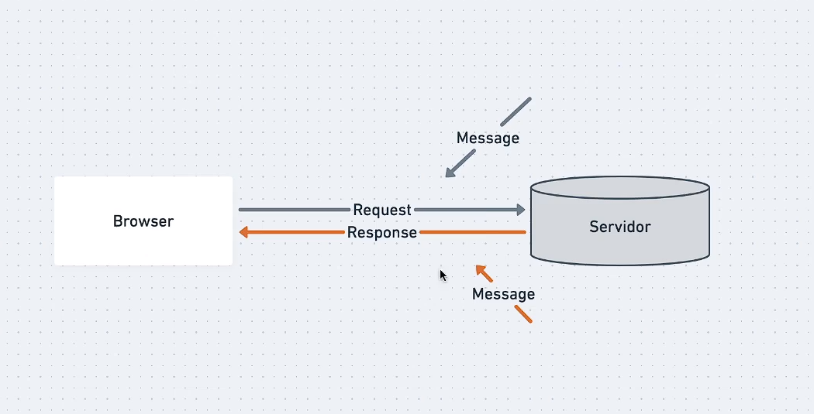
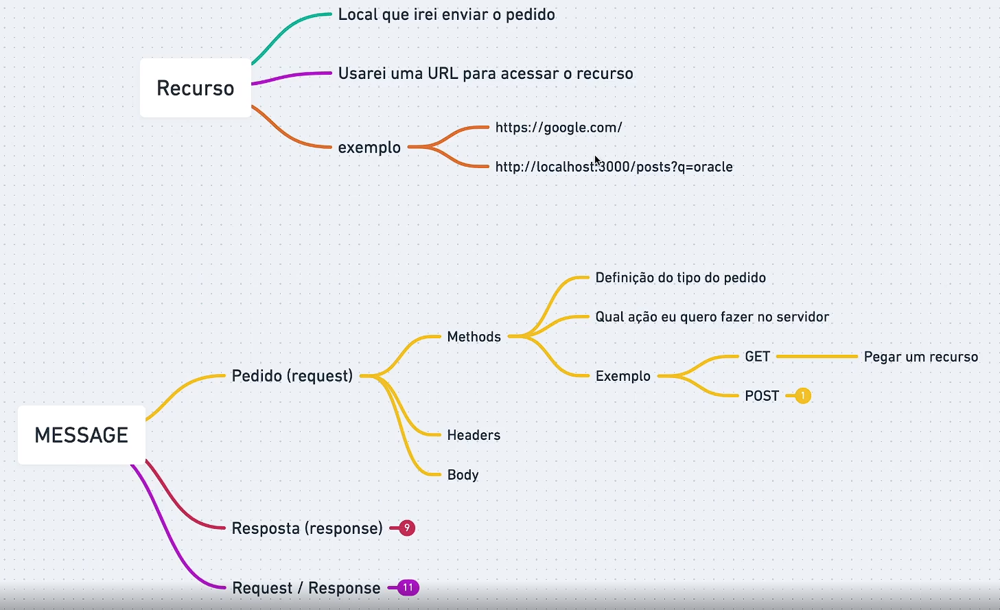
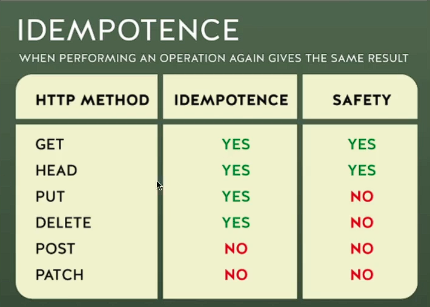
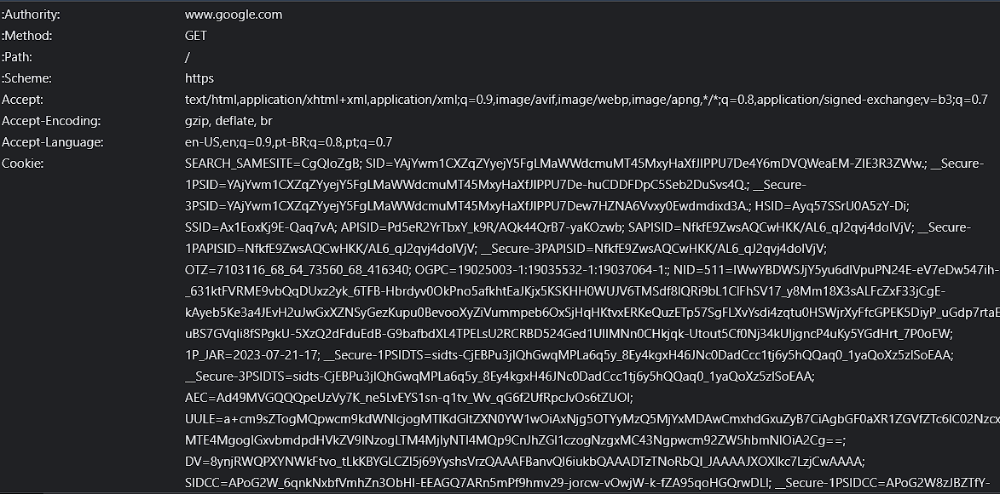
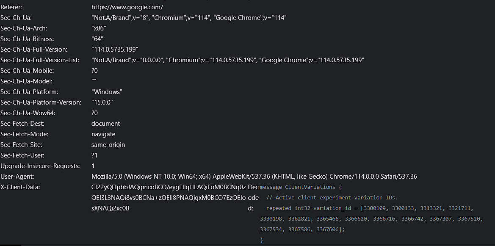
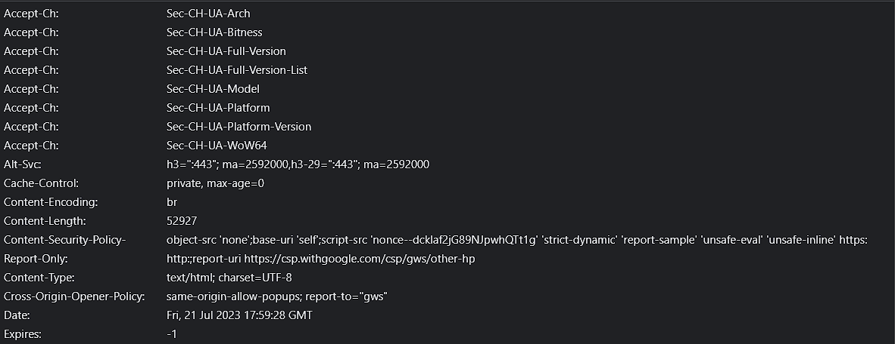
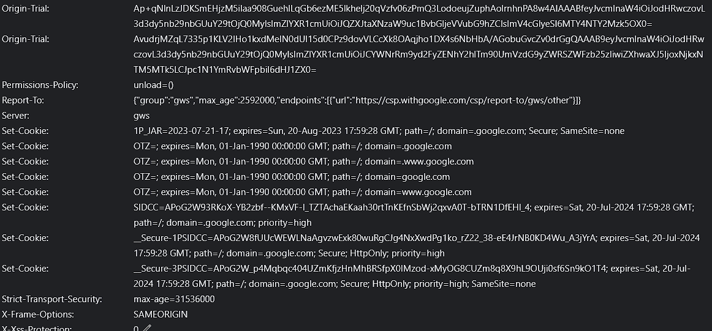

## Hypertext Transfer Protocol (Protocolo de transferência de hipertexto)

    - Permite troca de informações e dados na internet
    - Uma troca de mensagens
    - HTML, CSS, Scripts, Imagens, Video
    - Uma chamada para cada um desses recursos

 

## MESSAGE

    - Pedido (request)
        - Methods - Definição do tipo de pedido; qual ação quero fazer no servidor
            - Ex.: `GET` - Pegar um recurso ou `POST` - Criar um recurso
        - Header
        - Body
    - Resposta (response)
        - Status Code - Resposta do servidor sobre o estado de pedido
            - Ex.: 200, 301, 404, 500
        - Header
        - Body
    - request/response
        - Header - Campos Informativos; Propriedade : valor
            - Ex.: Content-type: application/json; User-Agent: Chorme; Request URL: www.google.com
        - Body - HTML;  JSON;  Conteúdo

## Conceitos
    HTTP foi feito para ser simples e legível à qualquer pessoa

    Baseado em cliente/servidor, ou seja, requisição/resposta

    Feito para não guardar estado, não guarda informações, não existe relação entre as conexões, isso mesmo igual na programação funcional, `stateless`

    Entretanto temos o uso de Sessões nos browsers onde podemos guardar por cookies ou local storages. Guardar sessões, ou seja, guardar essa informação, de login por exemplo, para ser enviada na próxima conexão

    E por fim ele é extensível, pois através dos headers (informações para comunicação) podemos fazer diversas formas de conexão entre cliente-servidor conforme a necessidade, fora que também possui body (corpo do pedido ou da resposta).

### Cliente
    
    Cliente é o User Agent, pode ser o browser ou o cURL, simplificando é a entidade que dá início à comunicação.
    
    O que o cliente faz são pedidos ao servidor, pedidos esses feitos através de ações, ações que por sua vez envolvem métodos HTTP GET, POST, DELETE, PUT)
    
### Servidor
    
    Se apresenta como uma máquina que está preparada para ouvir e processar 
    
    Encarregado de dar o reponse.
    
    Lembrando que um servidor pode estar em vários computadores, como vários servidores podem estra em um único compuitador
    
### Proxies
    
    Podemos entender como representantes, fica entre o cliente e o servidor, ajudam a fazer o transporte de dados, roteador é um proxie por exemplo.
    
    Tem diversas Funções:
    
    1. Cache para poder devolver uma informação um pouco mais rápido
    2. Filtro tipo um controle parental ou antivírus
    3. Load balancing, usar proxies para carregar um vídeo pesado mais rápido
    4. Autenticação, autorização

## URI
    Uniform Resource Identifier - Usado para identificar um recurso pelo nome ou localização

    Ex.: Eu sou um recurso, meu nome, minha localização

    Recurso (resource) é o alvo do pedido. Ele é qualquer coisa identificável (entidade). Se podemos identificar, nomear, endereçar ou manipular, estamos falando de um recurso

    Ex.: 

    - Digital
        - Email - acessado pelo protocolo `mailto: email@dominio.com`
    - Abstrata
        - Sessão
        - Autenticação
    - Física
        - Produtos
        - Usuários

    Então nós podemos procurar por dois caminhos:

### Locator
    
    usamos URL (Uniform Resource Locator) - Através dele chegamos ao recurso
    
    Ela é composta de Componentes
    
    - Obrigatórios
        - Protocolo
        - Domínio
            - https://www.rocketseat.com.br/blog
            - https://www.youtube.com/watch?v=vpYct2npKD8
            - localhost:1502/index.html#algumlugar
    - Opcionais
        - Subdomínio - world wide web - rede mundial de computadores
        - Path
        - Parâmetros
        - Porta
        - Âncora
### Name
    
    URN - uniform Resourcer Name
    
    Também conseguimos encontrar um recurso nomeado não sabendo o local dele
    
    Ex.: URN:isbn:0451450523

## HTTP Messages
    Numa comunicação necessariamente temos que ter mensagens

    Essas mensagens eram definidas a partir do HTTP/1.1, normalmente legível com textos, ainda hoje pode encontrar esse tipo de mensagem embora exista uma versão mais moderna e otimizada que é o HTTP/2 que possui uma estrutura binária sendo mais otimizada, mas é a mesma maneira da versão 1.1

    Request

        Tipo de mensagem que é o pedido, composto pelo 1. Método - verbo HTTP que vai informar ao servidor a intenção do pedido - 2. Protocol Version - versão do pedido do protocolo - 3. URI - o identificador uniforme de recursos, no caso geralmente é a URL.

    Response

        Tipo de mensagem que é a resposta, composta pela 1. Protocol Version - versão do protocolo - 2. Status Code - Responsável por dizer se deu certo a resposta ou deu algum problema.

## HTTP Method
    Define um conjunto de métodos HTTP, método ele indica a ação que o cliente deseja operar

    Podem ser chamados de verbo HTTP, cada um possui seu próprio significado

    Características

    - Seguros
        - Não altera o estado do servidor
        - Somente Leitura
        - Cliente não solicita alterações
        - Não a carga extra para o servidor
        - O servidor é o responsável por manter o método seguro
            - Ex.: GET, OPTIONS, HEAD
    - Idempotente
        - Ao executar o método a resposta deverá ser sempre a mesma
            - Todos os Seguros são Idempontentes, o PUT e o DELETE
        - Status Code pode ser diferente
        - O servidor tem a responsabilidade de retornar os dados da mesma maneira
        - Essa especificação não é garantia de que todos os servidores irão aplicar o conceito corretamente
            

            

    ---

    Options

    Serve para dar informações sobre a disponibilidade da requisição

    `curl -X OPTIONS URL -i` 

    Ele é seguro e Idempotente, fora que não possui body no request nem no response.

    Não se usa em formulários HTML e não é cacheable

    Get

    Pega recursos, somente recebe dados

    `curl URL`

    É seguro e Idempotente, não posso enviar body no request, apenas possui body no response

    Usa-se em formulários HTML e é cacheable(Disponibilidade para cache, ou seja, ele pode gaurdar algo em memória, para se ter uma resposta mais rápida).

    Head

    Parece o GET porém recebemos apenas o cabeçalho

    É seguro e idempotente, não tem body nem no response e nem no request

    Não uso em formulários HTML e pode ser cacheable

    `curl -I URL`

    Post

    Publicar/Cadastrar um recurso em algum lugar

    Não é seguro nem idempotente, possui body no request e no response

    Pode ser cacheable e pode ser usado em formulários HTML

    `curl -d '{"id": "2", "title": "json-server-2", "author": "Shelldon Ryan"}' -H 'Content-type: application/json' -X POST URL`

    Put

    Criar(Status Code ⇒ 201) ou atualizar(Status Code ⇒ 204 ou 200) um novo recurso

    Não é seguro e é idempotente

    Possui body para o request, ams não possui para a response

    Sem cacheable e sem uso em formulários HTML

    `curl -d '{"Name": "Shelldon Ryan"}' -H 'Content-type: application/json' -X PUT URL`

    Patch

    Modificação parcial de um recurso. Não é seguro nem idempotente. O body está presenta tanto na request como na response.

    Não se usa em formulário e nem se faz cacheable.

    `curl -d '{"Name": "Shelldon Ryan"}' -H 'Content-type: application/json' -X PATCH URL`

    Delete

    Serve para deletar um recurso. Idempontente apenas.  body no request/response ⇒ possibilidade. Não se usa em formulário e nem se faz cacheable.

    - Status Code
        - 200: OK
        - 202: Accepted
        - 204: No content

    `curl -X DELETE URL`

## Headers
### O que são headers?

    São cabeçalhos, informações adicionais para o pedido e resposta

    Geralmente são “property: value”

    General

    Meio que um agrupamento geral, serve tanto para o request como para o response

    URL - Method - Status Code - Remote Adress - Referrer Policy

### Request

    Cabeçalho do pedido

### Response

    Cabeçalho da resposta

