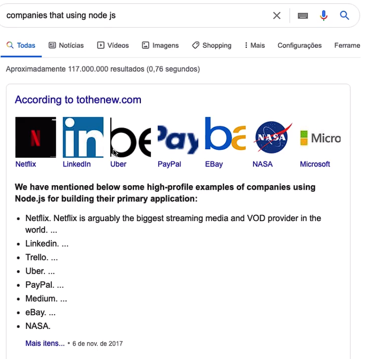
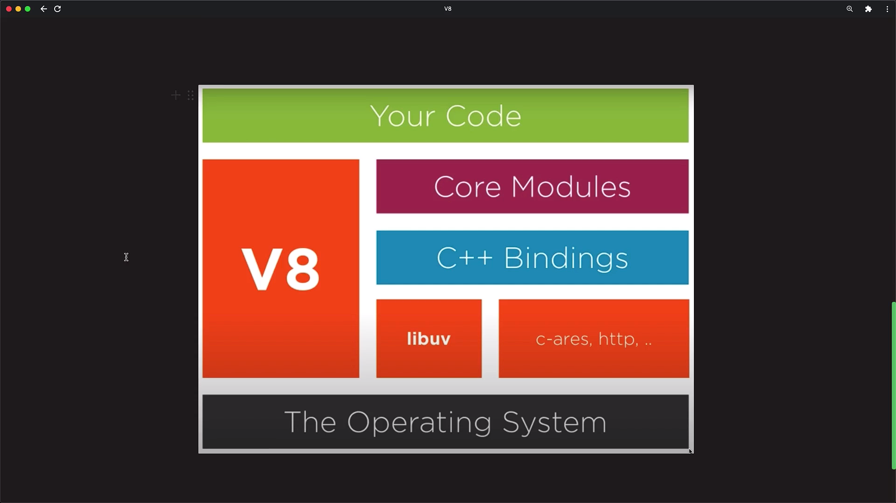
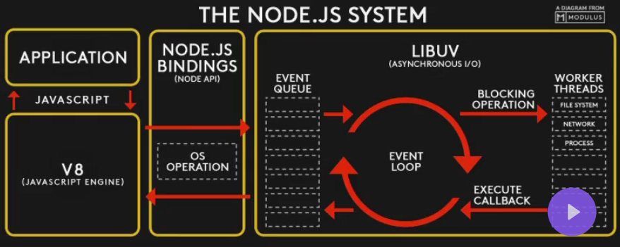

### O que Podemos fazer com o NodeJS?

Nos ajuda no desenvolvimento de:

- back-end com Js
- Front-end com Js
- Micro Serviços - Micro Aplicações completas
- Construir API - Local onde se pode disponibilizar dados para que outros, front-end por exemplo, consuma nossa API
    - geralmente feita no back-end e consumida pelo front-end
    - Pode ser um desktop, um Mobile, um WebApp consumindo essa API.
    - São basicamente os dados que o back-end está enviando
- Fazer scripts e Automação
- Machine Learning
- IA

**Restrição:** Se for necessário muito processamento , no caso CPU, não é recomendado usar nodeJS. 

Exemplo: Um processamento muito forte de fotos ou vídeos

- ******************Vantagens******************
    1. Muito Rápido, tanto na execução como na prototipação de uma aplicação
    2. Alta Escalabilidade
    3. Construção de Aplicações de ponta
        
        <a href="">  </a>

    4. JS Everywhere, ou seja, com apenas uma linguagem conseguimos fazer muita coisa 
    5. Ecossistema enorme, tanto de comunidade, como de módulos 
    6. Casos de Uso nodeJS
        - Netflix
            
            No início, a Netflix usava Java no lado do servidor e JavaScript no front-end, então o desenvolvedor tinha que codificar duas vezes, o que exigia que eles entendessem os dois idiomas. Eles tiveram que escrever tudo duas vezes para tratamento de erros, rastreamento de atividades e depuração.
            
            Em primeiro lugar, eles estavam usando o Java no lado do servidor e o javascript no lado do navegador. Eles primeiro tentaram desenvolver o protótipo usando Node.js e o mesmo com java também. Para desenvolver o protótipo usando o java, eles designam uma equipe de 5 desenvolvedores e uma equipe de 2 desenvolvedores para usar o node.js.
            
        - Paypal
            
            Um dos principais motivos para migrar para o Node.js
            
            - Ter um idioma comum para ambos os lados do servidor e do navegador.
            - Desempenho que o Node.js oferece. De 40 minutos + tempo de inicialização, eles passaram para menos de um minuto
            - O Node tem muitos módulos que são de código aberto
            - Para construir o aplicativo de página única
            
            O Paypal obteve o bom resultado em desempenho que o usuário pode definitivamente rotular:
            
            Redução de 35% no tempo médio de resposta para uma mesma página. Isso resultou em páginas sendo servidas 200 ms mais rápido
            
    7. https://www.simform.com/nodejs-use-case/

### O que é o NodeJS?

Ele é um JS Runtime Enviroment

- Js → JavaScript, uma linguagem de programação
- Runtime Enviroment→ Ambiente de execução
    - Um ambiente completamente dele, como se fosse um mini S.O., que é exclusivo do Js, ou seja, tudo que está nesse ambiente está separado de coisas externas a ele, neste caso.
    - Se comunica com o S.O., seja linux ou windows ou mac, e esse por sua vez se comunica com o Hardware.
- No caso, NodeJS não é uma linguagem de programação, e não é um framework.
    
    Um framework é uma estrutura de desenvolvimento que fornece funcionalidades e ferramentas pré-definidas para facilitar a criação de aplicativos. Ele oferece uma base sólida para os desenvolvedores construírem seus projetos, fornecendo um conjunto de bibliotecas, padrões de design, convenções e componentes reutilizáveis. Um framework pode incluir módulos para lidar com tarefas comuns, como manipulação de banco de dados, gerenciamento de sessões de usuário, autenticação, roteamento de URL e muito mais.
    
    No contexto do Node.js, é correto dizer que o Node.js não é um framework nem uma linguagem, mas sim um ambiente de execução de JavaScript do lado do servidor. O Node.js permite que você execute o JavaScript fora do navegador, no servidor, e é amplamente utilizado para criar aplicativos web escaláveis e de alto desempenho. Embora o Node.js forneça um conjunto de bibliotecas e módulos embutidos, ele não oferece todas as funcionalidades e convenções de um framework completo. No entanto, existem muitos frameworks construídos em cima do Node.js, como o Express.js, que fornecem uma estrutura adicional para o desenvolvimento de aplicativos web.
    

- ******************google v8 - JavaScript Engine******************
    
    Compõe o ambiente, a maquina virtual, que irá rodar o Js na máquina.
    
    - [ ]  Interpretador de Js para linguagem de máquina: Isso significa que o Google V8 é responsável por interpretar o código JavaScript e convertê-lo em instruções compreensíveis pela máquina.
    - [ ]  Criado em C++: O Google V8 é implementado em C++, o que permite um desempenho eficiente e um alto nível de otimização.
    - [ ]  Baseado nas ultimas features do Js: O Google V8 é desenvolvido para suportar as últimas funcionalidades e melhorias da linguagem JavaScript. Isso significa que ele incorpora os recursos mais recentes do JavaScript, permitindo que os desenvolvedores utilizem essas funcionalidades em seus aplicativos.
    - [ ]  Focado para chrome mas tem todo o cuidado de não quebrar o Node: Embora o Google V8 seja uma parte central do Google Chrome, ele também é utilizado pelo Node.js. A equipe do Google V8 se preocupa em garantir a compatibilidade com o Node.js, a fim de que as aplicações desenvolvidas para o Node.js também possam se beneficiar das otimizações e recursos oferecidos pelo V8.
    - [ ]  Não possui o DOM, console ou File System: O Google V8 é uma engine JavaScript focada na execução do código JavaScript, mas não inclui recursos como o Document Object Model (DOM), console ou File System. Esses recursos são fornecidos pelo ambiente em que o V8 é executado, como o navegador no caso do Google Chrome ou o ambiente de execução do Node.js. O V8 se concentra em lidar com a execução do código JavaScript em si.
    
    ```jsx
    function run() {
    	return 'hello';
    }
    /*basicamente o v8 pega uma linguagem javascript e converte ela 
    até ficar mais proxima da linguagem de maquina.*/
    ```
    
    <a href="">  </a>
    

### **************************************Como Funciona o NodeJS?**************************************

Com a técnica Apache trabalhamos da seguinte forma, ao usuário realizar um “request”, é fornecida a ele um thread que irá até o servidor, onde estará um banco de dados resgatar esse pedido e trazer de volta para o usuário.

O node é totalmente diferente já que ele detém as seguintes características:

1. Asynchronous
2. no-blocking
3. single-thread

- **Avançando no entendimento**
    
    <a href="">  </a>
    
    ```jsx
    function c() {
    	setTimeout(() => {console.log('c')}, 1000)
    	return
    }
    
    function b() {
    	console.log('b')
    	return c()
    }
    
    function a() {
    	console.log('a')
    	return b()
    }
    
    a()
    ```
    
    De onde veio e para onde vai?
    
    - Ryan Dahl criou essa ferramenta em 2009
    - NPM(Node Packpage Manager) versão em 2011 https://npmjs.org
        - Compartilhamento de bibliotecas
        - Grande mudança na manutenção e compartilhamento de códigos
    - 2015 Node.js Foundation
        - Incluiu: IBM, Microsoft, PayPal e Groupon
        - Passou a fazer parte do https://openjsf.org/
    - https://github.com/nodejs/node
    - Comunidade ativa
    
    > Criado para ser uma JavaScript Runtime construída com o V8 Engine Chorme
    > 

### Instalando o NodeJS

- REPL
    - [ ]  Read-Level-Print-Loop
    - [ ]  Escrever JavaScript em um ambiente node, direto do terminal
    - [ ]  Para entrar digite node.exe no terminal

### Iniciando na prática

- Globals no nodeJs
    
    refere-se a um conjunto de objetos e funções globais que estão disponíveis em qualquer lugar do seu código.
    
    Esses globals são automaticamente adicionados ao escopo global pelo Node.js para fornecer funcionalidades comuns e facilitar o desenvolvimento
    
- O que são e como utilizar módulos
    
    Para podermos utilizar módulos, e chamá-los, módulos esses que são nativos do nodeJs é utilizando o método `require` . Também podemos criar nossos próprios módulos ou instalar de terceiros.
    
- Criando Módulos
    
    você precisa da função exports, na função global module, a partir daí você pode atribuir qualquer tipo de dado, seja uma string, número, objeto, array
    
- Pegando Informações do processo
    
    Basicamente com o objeto `process` conseguimos viver diversas informações como versão do node, diretório do arquivo e outras várias coisas. No caso ele nos retorna tudo em uma lista, ou seja, array.
    
- Passando flags como argumento
    
    ```jsx
    module.exports = function getFlagsValue(flag) {
    	const indexFlag = process.argv.indexOf(Flag) + 1
    	return process.argv[indexFlag]
    }
    ```
    
    ```jsx
    const getFlagsValue = require(./flags.js)
    
    console.log(`Hi ${getFlagsValue(--name)}, ${getFlagsValue(--greetings)})
    ```
    

### ********NPM - Node Packpage Manager********

Basicamente irá ser utilizado coisas de terceiros, de outros criadores.

No caso essas coisas seriam Dependencies, modules & packpage.

para verificar se o npm está instalado, colocamos no nosso terminal `npm -v` 

Iniciando um pacote com npm

Para criar o packpage basta apenas dar um `npm init -y` no terminal e assim é criado um arquivo.json automaticamente. Sem o -y irá ser feito uma série de perguntas.

packpage.json (JavaScript Object Notation)

basicamente se trata de um pacote que tem dentro um objeto JavaScript e dentro dele tem algumas informações como nome do pacote, versão, autor, licensa, script, palavras-chave, descrição, e arquivo principal.

Para instalar um módulo é só dar um `npm install nomeDoModulo` no terminal e ele irá buscar aquele módulo e instalar, adicionando diretórios e arquivos no diretório principal.

Qualquer coisa que mudarmos no nosso packpage.json, é necessário que seja dado um `npm update` no terminal para atualizar as alterações. E caso o nosso projeto dependa de uma certa propriedade apenas na parte de desenvolvimento podemos dar um `npm install nomeDoModulo -D` para que essa propriedade seja um devDependencies, aqui esses módulos só seram instalados quando estiver na parte de desenvolvimento.

A node_modules é um diretório que guarda todos os módulos que são necessários naquele projeto. Por mais que no meu packpage a dependencies seja apenas do cfonts, o cfonts depende de outros módulos e esses módulos de outros, assim gera uma cadeia e por isso fica bem gordo esse diretório. Vale ressaltar que na hora de subir esse projeto pro git não podemos chamar essa pasta, então devemos criar um arquivo .gitignore e colocar o diretório node_modules lá.

o packpage-lock serve para fazer um mapeamento de todas as dependências do seu projeto. Nele não se mexe! ela deixa seu projeto mais rápido, mais inteligente, trabalha com a manutenção dos módulos do seu projeto.

Instalar de maneira global: `npm i nomeDoModulo -g`

Ver onde está instalado: `npm root -g`

Desinstalar de maneira global: `npm uninstall nomeDoModulo -g` 

- Criar scripts para rodar com o npm
    
    ```jsx
    "scripts": {
        "dev": "node.exe firstScript.js"
      },
    ```
    
    Basta apenas criar um arquivo chamado firstScript.js que o npm irá rodar o script. através do comando `npm run dev` .
    
- Gerenciando versões de dependências
    
    major.minor.patch
    
    major - É a versão do projeto, e ela tem a possibilidade de quebrar dependendo do que acontecer
    
    minor - Vai ter alterações mas não tem a possibilidade de quebrar o que está acontecendo nesse pacote
    
    patch  - Significa que está resolvendo algum tipo de bug, está sendo resolvida alguma coisa dentro desse pacote
    
    ^ - Significa que sempre que atualizar o npm, ele irá atualizar o minor e o patch
    
    ~ - Significa que sempre que atualizar o npm, ele irá atualizar o patch
    
    * - Signifiac que vai mudar tudo
    
    quando tiver apenas o major.minor.patch significa que é uma versão fixa e que nunca vai mudar
    
    Verificar versões: `npm oputdated`
    
    voltar versões: `npm nomedomodulo@versãoanterior`
    
    Colocar ultima versão: `npm nomedomodulo@latest`
    
    Após voltar, ir para a recomendada: `npm upgrade` 
    

### BestMe App: Interagindo com o aplicativo

Nesse módulo iremos criar um app chamado “melhor de mim”, e usaremos ele sempre ao final do dia para podermos refletir sobre a nossa jornada, nele iremos aprender sobre assincronismo e a se comunicar com o processo enquanto ele estiver rodando

- proces.stdout - É o que vai escrever algo de saída
- process.stdin

Apresentando as perguntas com process.stdout.write

Basicamente esse comando é utilizado para podermos escrever mensagens no terminal

```jsx
const questions = [
    'O que aprendi hoje?',
    'O que me deixou aborrecido? E o que eu poderia fazer para melhorar?',
    'O que me deixou feliz hoje?',
    'Quantas pessoas ajudei hoje?',
]

const ask = (index = 0) => {
    process.stdout.write(questions[index] + "\n\n")
}

ask()
```

Recebendo dados de entrada e assincronismo com process.stdin.on

Esse processo se inclina para o recebimento de dados, no caso o on ele meio que deixa terminal pronto para recerber qualquer tipo de dado, e ao ser inserido executa-se uma função como segue o bloco de código:

```
process.stdin.on('data', data => {
    process.stdout.write( data.toString().trim() + "\n" )
    process.exit()
})
```

Lógica para apresentar perguntas e salvar respostas

Basicamente foi criado uma lógica para salvar as respostas, seguir com as próximas perguntas e finalizar a aplicação mostrando todas as respotas

```jsx
const questions = [
    'O que aprendi hoje?',
    'O que me deixou aborrecido? E o que eu poderia fazer para melhorar?',
    'O que me deixou feliz hoje?',
    'Quantas pessoas ajudei hoje?',
]

const ask = (index = 0) => {
    process.stdout.write('\n\n' + questions[index] + " > ")
}

ask()

const answers = []
process.stdin.on('data', data => {
    answers.push( data.toString().trim())
    if (answers.length < questions.length) {
        ask(answers.length)
    } else {
        console.log(answers)
        process.exit()
    }
})
```

Finalizando

process.on, utilizamos ele para que ao process.exit() ser rodado, o process fique ligado e rode uma função, que no caso seria uma conclusão com todas as respostas!

### ************Timers************

Timers é uma maneira de trabalhar com o tempo com o nodejs

setTimeOut

Ele roda uma função depois de x milissegundos

```
const timeOut = 4000
const timeIn = 2000

const start = () => console.log('Start!')
const finished = () => console.log("done!")

setTimeout(start, timeIn)
setTimeout(finished, timeOut)
```

Aqui podemos perceber que o start virá primeiro do que o finished já que o nodejs trabalha de maneira assíncrona, vale lembra também que setTimeOut roda funções callback, já que ela será guardada em algum lugar e só será rodada pelo event loop ao atender uma condição, no caso do setTimeOut após o time estipulado.

O clearTimeOut serve para cancelar qualquer setTimeOut de uma aplicação

setInterval

irá rodar uma função tantas vezes depois de x milissegundos

O clearInterval serve para cancelar qualquer setInterval de uma aplicação

```jsx
const timeOut = 900
const checking = () => console.log("Check!")

const intervalrs = setInterval(checking, timeOut)

setTimeOut( () => clearInterval(intervalrs), 4000)
```

### **************Event Module**************

É um mecanismo para disparar eventos, ouvi-los, fazer alguma ação quando ouvir o evento.

E também se trata da base para muitos outros módulos como: http, stream, file system, etc.

Event Emitter é uma função do estilo classe que basicamente emite um objeto com algumas proriedades.

```jsx
const {EventEmitter} = require('events')

const ev = new EventEmitter()

console.log(ev)
```

from bingIA: Em JavaScript, um EventEmitter é um módulo que facilita a comunicação entre objetos em um programa Node.js. Ele permite que você crie e ouça eventos personalizados. EventEmitter é uma classe que é definida no módulo de eventos. Você pode criar uma instância dele e usar seus métodos para emitir eventos e registrar ouvintes para eles. Quando um evento é emitido, todos os ouvintes registrados são chamados sincronamente.

Emitindo eventos

Para emitir um evento basta por `ev.emit('saySomething')` 

Ouvindo e executando

`ev.on()` , isso aqui é necessário para que se ouça o evento, e ao ser ouvido será executado a função que no caso é o segundo argumento dessa função no início do parágrafo.

```jsx
const {EventEmitter} = require('events')
const ev = new EventEmitter()

ev.on('saySomething', (name) => {
    console.log('Eu ouvi você, ' + name + '\n')
})

ev.emit('saySomething', ("João"))
ev.emit('saySomething', ("Geraldo"))
ev.emit('saySomething', ("Camilla"))
```

invés do `on` podemos por `once`, que agora ele só dispara uma única vez.

Mas como ele é a base para outros módulos?

```jsx
const { inherits } = require('util')
const {EventEmitter} = require('events')

function character(name) {
    this.name = name
}

inherits(character, EventEmitter)

const chapolin = new character("Chapolin");

chapolin.on('help', () => console.log(`Eu! o ${chapolin.name} colorado!`))

console.log("Oh! E agora, quem poderá me defender?")
chapolin.emit('help')
```

**`this`** é uma palavra-chave em JavaScript que se refere ao objeto atual. Dentro de uma função construtora, como a função **`character`** que mencionamos anteriormente, **`this`** se refere ao objeto que está sendo criado. Quando você usa **`this.name = name`** dentro da função **`character`**, você está atribuindo o valor do parâmetro **`name`** à propriedade **`name`** do objeto que está sendo criado. Isso permite que você acesse e modifique as propriedades do objeto usando a palavra-chave **`this`**.

**`this.name = name`** é uma linha de código JavaScript que atribui o valor do parâmetro **`name`** passado para a função **`character`** à propriedade **`name`** do objeto que está sendo criado. Isso significa que, ao criar um novo objeto usando a função **`character`**, você pode especificar o valor da propriedade **`name`** desse objeto passando um argumento para a função. Por exemplo, se você criar um novo objeto com **`var myCharacter = new character('João')`**, a propriedade **`name`** do objeto **`myCharacter`** será definida como **`'João'`**.

Quando você usa a palavra-chave **`new`** seguida pelo nome de uma função, como em **`new character('João')`**, você está criando um novo objeto do tipo **`character`**. A função **`character`** é chamada de **construtor** e é usada para inicializar o novo objeto com os valores que você especificou como argumentos. Neste caso, o novo objeto terá uma propriedade **`name`** com o valor **`'João'`**.