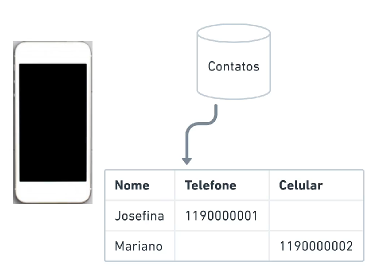
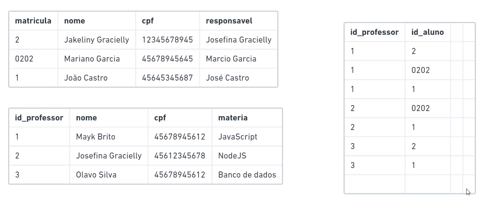
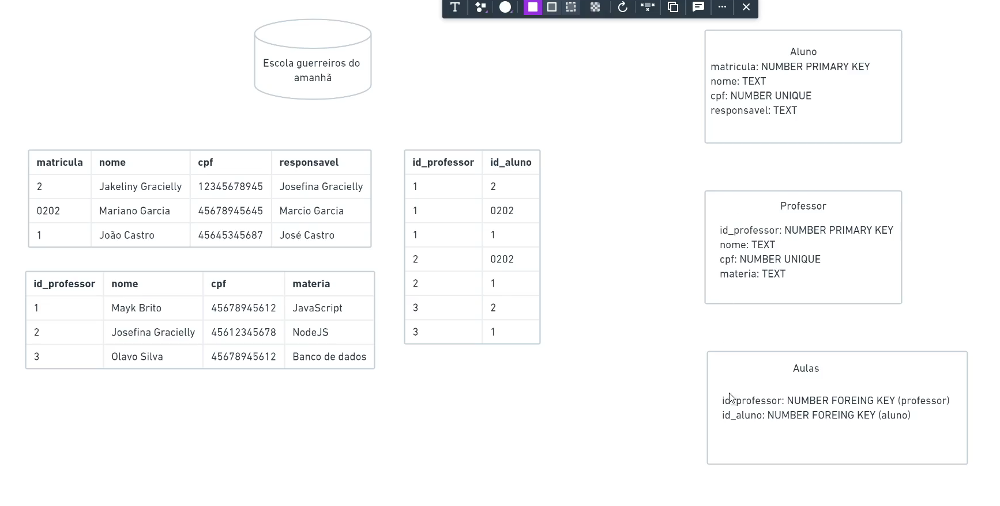
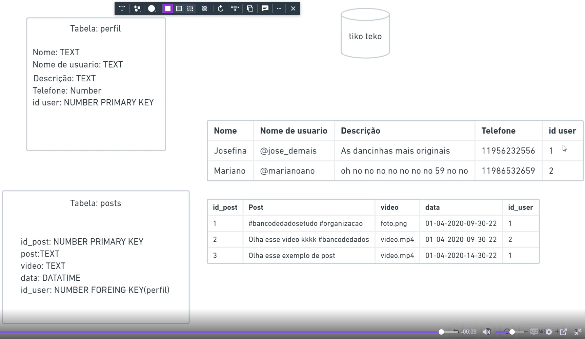

# SQL
## Introdução
    
    O que é um banco de dados?
    
    é um local que vai guardar informações de forma organizada.
    
    
    Exemplo de repositório sistêmico de informações
    
<a href="">
    
</a>

## Conceitos
    
    Tabelas
    
    São os quadrados, compostos por linhas e colunas, onde são armazenados os dados.
    
    Campos
    
    Se trata da especificação da coluna, geralmente a primeira linha da tabela, o cabeçalho. Títulos das informações que seram guardadas na tabela
    
    Informações
    
    Sâo os dados que cadastramos em cada campo da tabela
    
## Tipos de Campos
    
    Text
    
    Basicamente usamos para especificar que um campo de uma tabela usa informações do tipo texto
    
    Number
    
    Basicamente usamos para especificar que um campo de uma tabela usa informações do tipo número
    
    Datatime
    
    Dado relativo a hora e a data
    
    Primary Key
    
    Basicamente é como o campo declarado primary key que o banco de dados vai controlar as linhas como únicas, cada informação diferente nesse campo se refere a outra linha, com outras características
    
    Regras para escrever nomes de campos e tabelas
    
    1. deve começar por uma letra do alfabeto
    2. Os caracteres não são permitidos ( ) + - / * ” ‘ ; = & | # > < ^ { } %
    3. Não pode conter espaços
    4. Não pode conter acentuação

## Comando SELECT
    
### SELECT

Tem por funções buscar informações, e nos mostrar essas informações

```sql
SELECT * FROM nome_da_tabela
```

* - Selecione todas as informações

FROM - De onde você está buscando as informações

<aside>
💡 Para puxar campos específicos basta substituir o * pelo nome do campos.

</aside>

```sql
SELECT nome_do_campos FROM nome_da_tabela
```

Ao final dessa linha podemos por o WHERE, para especificarmos qual informação e de qual coluna queremos que seja mostrada a linha.

```sql
    SELECT * FROM aluno WHERE matricula = 1
```

Para especificar o tipo de informação exatamente como está usamos = e colocamos a informação, porém caso não seja específico podemos colocar “like”.

```sql
    SELECT * FROM aluno WHERE nome like 'j%'
```

A % indica que pode ser qualquer coisa, com tanto que a primeira letra seja j. Lembrando que podemos usar o porcentagem em qualquer lugar!
    
## Operadores Relacionais
    
### igual =

```sql
SELECT * FROM aluno WHERE cpf = 45678945645

so funciona em campos que sao number
```

### like

```sql
SELECT * FROM aluno WHERE nome like 'j%'
```

### Maior que >

```sql
SELECT * FROM aluno WHERE matricula > 1
```

### Menor que <

```sql
SELECT * FROM aluno WHERE matricula < 3
```

### Menor igual que ≤

```sql
SELECT * FROM aluno WHERE matricula <= 2
```

### Maior igual que ≥

```sql
SELECT * FROM aluno WHERE matricula >= 2
```

### Não igual a <>

```sql
SELECT * FROM aluno WHERE matricula <> 1
```

### Diferente de ≠

```sql
SELECT * FROM aluno WHERE matricula != 2
```

## Operadores Matemáticos
    
### Adição +

```sql
SELECT * FROM aluno WHERE matricula = 1 + 1
```

### Subtração -

```sql
SELECT * FROM aluno WHERE matricula = 3 - 2
```

### Multiplicação *

```sql
SELECT * FROM aluno WHERE matricula = 0.5 * 4
```

### Divisão /

```sql
SELECT * FROM aluno WHERE matricula = 4 / 2
```

### Módulo %

```sql
SELECT * FROM aluno WHERE matricula = 4 % 3
```
    
## Operadores Lógico
    
### AND

```sql
SELECT * FROM aluno WHERE matricula = 7 % 3 AND nome like 'j%'
```

### OR

```sql
SELECT * FROM aluno WHERE matricula = 8 % 3 OR nome like 'j%'
```

### BETWEEN

```sql
SELECT * FROM aulas
    WHERE id_professor BETWEEN 1 and 2
```

```sql
SELECT * FROM aulas
    WHERE id_professor NOT BETWEEN 1 and 2
```

### IN e NOT IN

```sql
SELECT * FROM aulas
    WHERE id_aluno IN(1, 2)
```

```sql
SELECT * FROM aulas
    WHERE id_aluno NOT IN(1, 2)
```

### IS NULL e IS NOT NULL

```sql
SELECT * FROM funcionarios
WHERE id_departamento IS NOT NULL
```

```sql
SELECT * FROM funcionarios
WHERE id_departamento IS NULL
```
    
## Mais Comandos
    
### INSERT INTO

```sql
INSERT INTO professor (nome, cpf, materia) VALUES ('Shelldon Ryan', 12343251233, 'Phyton')
```

### UPDATE

```sql
UPDATE aluno SET nome = 'Perereca Suicida', responsavel = 'Rainha Mortadela' WHERE matricula = 4
```

Se não for usado o where, o banco de dados atualiza todos os nomes.

### DELETE

```sql
DELETE FROM aluno WHERE matricula = 4
```

Ele basicamente deleta as informações daquele registro, ou seja, todas as que tiverem na mesma linha da primary key identificada após o where será deletada do banco de dados.
# SQL Avançado
### Relação entre Tabelas

<a href="">
    
</a>

<a href="">
    
</a>

### Foreign Key

<a href="">
    
</a>

### Unique

Comando para avisar ao banco de dados que aquele campo não pode se repetir em outra linha

<a href="">
    
</a>

## Unindo Tabelas

### JOIN

Comando que serve para trazer o conteúdo de duas tabelas que possuem um relacionamento.

```sql
SELECT * FROM funcionarios 
JOIN departamentos
ON departamentos.id_dept = funcionarios.id_departamento
```

### JOIN com WHERE

Ajuda você a filtrar o que você quer ver daquela relação JOIN. Por exemplo de 5 áreas diferentes quero ver apenas de uma área x.

```sql
SELECT * FROM funcionarios 
JOIN departamentos
ON departamentos.id_dept = funcionarios.id_departamento
WHERE funcionarios.id_departamento = 2
```

### JOIN especificando campos

```sql
SELECT funcionarios.nome, funcionarios.cpf, departamentos.descricao
FROM funcionarios
JOIN departamentos
ON departamentos.id_dept = funcionarios.id_departamento
```

### Alias

Serve para atribuir nomes parciais as tabelas.]

```sql
SELECT func.nome as "Nome", func.cpf as "CPF", dept.descricao as "Departamento"
FROM funcionarios as func
JOIN departamentos as dept
ON dept.id_dept = func.id_departamento
```

### LEFT OUTER JOIN

Força a mostrar todo o conteúdo de uma tabela, por mais que no `ON` a condição esteja sujeita a não mostrar certa linha da tabela. 

```sql
SELECT * FROM funcionarios 
LEFT OUTER JOIN departamentos
ON departamentos.id_dept = funcionarios.id_departamento
```

```sql
SELECT func.nome as "Nome", func.cpf as "CPF", dept.descricao as "Departamento"
FROM departamentos as dept
LEFT OUTER JOIN funcionarios as func
ON dept.id_dept = func.id_departamento
```

## Comandos Avançados

### ORDER BY

Ele organiza as linhas, NUMBER por onde crescente, TEXT por ordem alfabética, depende do campo que está servindo de argumento para ser organizado

```sql
SELECT * FROM aluno
ORDER BY matricula //DESC
```

`DESC faz com que faça o inverso`

### LIMIT

Limita a quantidade de linhas que é mandado com resposta.

`SELECT * FROM aluno LIMIT 2`

### OFFSET

Vai dizer quanto registros ele vai ignorar sempre os primeiros

`SELECT * FROM aluno LIMIT 3 OFFSET 3`

### COUNT

Ele conta a quantidade de elementos dentro do campo

`SELECT COUNT(id_departamento) FROM funcionarios`

### GROUP BY

Agrupa dados semelhantes, e assim o `count` irá contar quantos tem naquele agrupamento

```sql
SELECT id_departamento, COUNT(id_departamento) 
FROM funcionarios
GROUP BY id_departamento
```

### HAVING

trabalha com condições, estabelece uma condição igualmente o `WHERE`, porém esse só funciona com campos, com `GROUP BY` ou `COUNT`, precisamos do `HAVING`

```sql
SELECT departamentos.descricao, COUNT(funcionarios.id_departamento) FROM funcionarios 
JOIN departamentos
ON funcionarios.id_departamento = departamentos.id_dept
GROUP BY departamentos.id_dept
HAVING COUNT(funcionarios.id_departamento) > 1
```

## Comandos Nas Tabelas

### CREATE TABLE

Serve para criar as tabelas do nosso banco

```sql
CREATE TABLE Alunos (
	matricula INTEGER PRIMARY KEY,
  nome TEXT,
  cpf INTEGER UNIQUE,
  responsavel TEXT
)

CREATE TABLE Professores (
	IdProfessor INTEGER PRIMARY KEY AUTOINCREMENT,
  nome TEXT,
  cpf INTEGER UNIQUE,
  materia TEXT
)

CREATE TABLE Aulas (
	idProfessor INTEGER,
  matricula INTEGER,
  FOREIGN KEY(idProfessor) REFERENCES Professores(IdProfessor),
  FOREIGN KEY(matricula) REFERENCES Alunos(matricula)
)
```

### ALTER TABLE

Serve para fazer alterações nas nossas tabelas

```sql
ALTER TABLE aluno RENAME TO alunos

ALTER TABLE professor RENAME TO professores

ALTER TABLE aulas RENAME COLUMN id_aluno TO matriculaAluno

ALTER TABLE aulas RENAME COLUMN id_professor TO IDprofessor
```

### DROP TABLE

Serve para excluir uma tabela