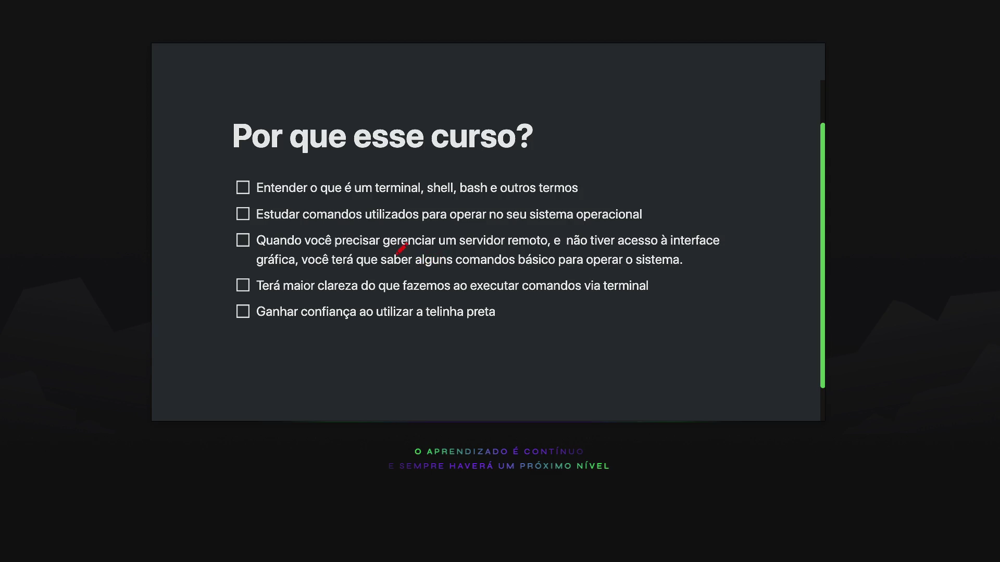
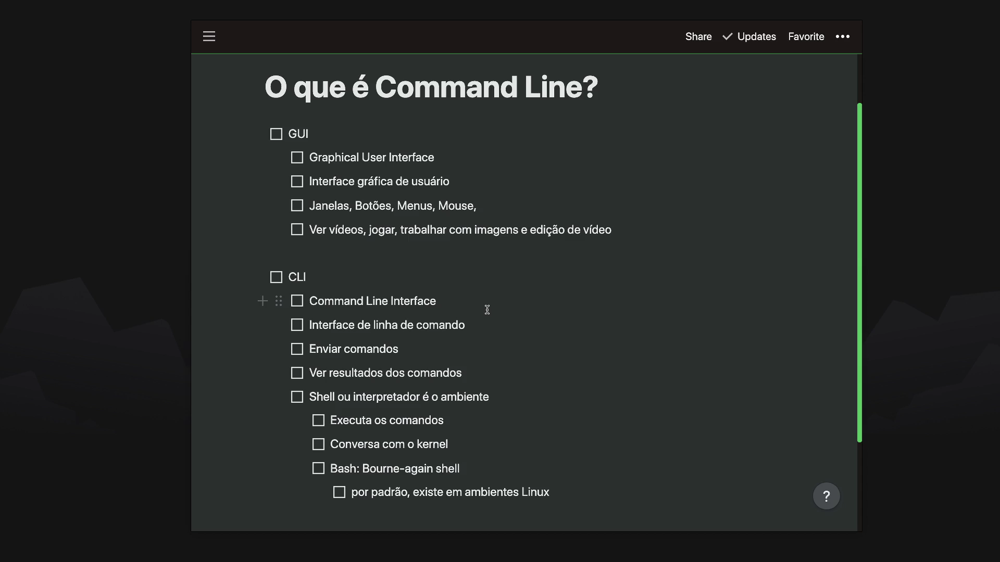
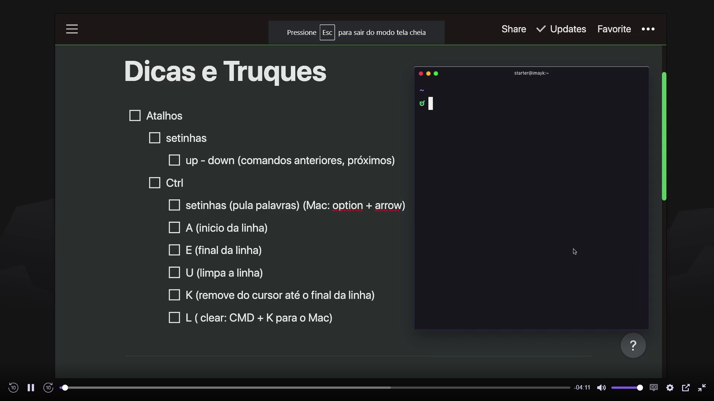

# Preparação e Dicas

## Por que esse curso?

## O que é Command Line?

## Sintaxe

### Command

    Programa que você está rodando

    Obrigatório

### Option(s)
    
    Mudar o comportamento do programa
    
    Explica ao comando como ele deve funcionar
    
    geralmente começa com um traço e é apenas uma letra
    
    E a maioria dos comandos oferecem muitas opções
    

### Argument(s)

    Onde o comando irá operar?

    Caminho do arquivo ou diretórios

---

## Tab Completion
    - O Tab Completion pode ser usado tanto nos comandos quanto nos argumentos, ele é básicamente uma ferramenta de busca de comandos, ativada a partir da tecla Tab, no caso dos argumentos, ele vai listar todas as pastas, arquivos e diretórios disponíveis no caminho.
    
## Atalhos
    

    

## Conseguindo ajuda

    através do comando “man”, que é remetente ao manual de comandos no próprio terminal.

    O comando “apropos”, vai de dar uma lista de comandos associado com a palavra que você colocar no argumento.

# Arquivos e Diretórios
## Informando o diretório atual
    
    Use o comando “pwd”.
    
## Navegando pelas pastas
    
    Command “cd” - change directory
    
    argument “.” - diretório atual
    
    argument “..” - volta ao diretório anterior
    
    argument “-” - voltar de onde veio
    
## Listando arquivos e pastas
    
    command “ls” - Lista arquivos e diretórios
    
    option “-l” - Mais informações
    
    option “-a” - all
    
    option “-h” - human
    
    option “-R” - recursive
    
    option “-S” - ordenar pelo tamanho
    
## Obtendo Informações dos Arquivos
    
    command “file” - Tipo do arquivo / Informações
    
    command “stat” - dono / modificações
    
## Criando diretórios
    
    command “mkdir”(make directory) - cria diretórios
    
    option “-p”(parents) - cria diretórios dentro do outro
    
## Criando arquivos
    
    command “touch” - Criar um ou mais arquivos / Alterar registro de data e hora de arq ou pastas.
    
## Copiando
    
    command “cp” - copia arq e pastas e põe em outro, o que receberá sempre é o ultimo argumento.
    
    option “-r” - copiar os diretórios de forma organizada
    
## Movendo e Renomeando
    
    command “mv” - move e renomeia arquivos e pastas
    
## Removendo
    
    command “rm” - remover arquivos e diretórios
    
    options “-r, -f” - se for um diretório com cadeias de outros dentro precisamos do recursivo, e caso precise forçar a remoção usamos o force.
    
## Wildcards (Curingas)
    
    “*” - pega um ou mais caracteres
    
    “?” - pega um caractere
    
## Encontrar Arquivos ou pastas
    
    command “find” - find <path> arg[expression]
    
    arguments - 1. -type <d|f> 2. -name 
    
## Ver conteúdos de arquivos
    
    command “cat” & “less”  - ver o conteúdo dos arquivos
    
## Editando arquivos
    
    usando os comandos “nano” e “vim”
    

> bash -c zsh/sh